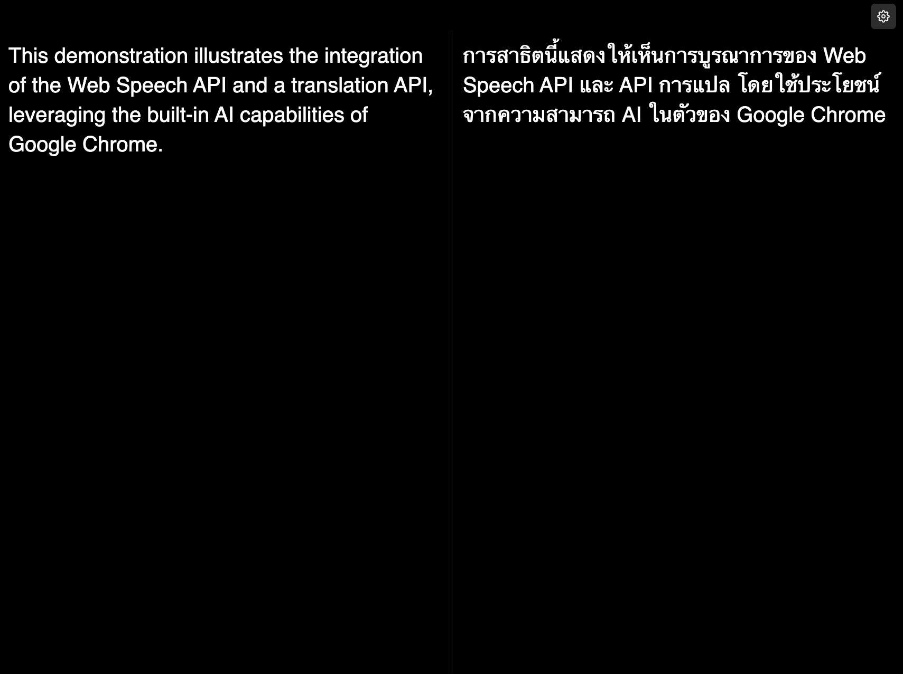

# Transcribe Screen

A simple, real-time speech transcription and translation application built with vanilla JavaScript and Tailwind CSS.



## Features

- **Real-time Speech Recognition**: Uses Web Speech API for live transcription
- **Instant Translation**: Real-time translation using the Translator API
- **Flexible Layouts**: Switch between vertical (side-by-side) and horizontal (stacked) layouts
- **Multi-language Support**: 60+ recognition languages and 50+ translation languages
- **Responsive Design**: Works on desktop and mobile devices

## Quick Start

1. **Install dependencies:**
   ```bash
   npm install
   ```

2. **Start development server:**
   ```bash
   npm run dev
   ```
3. **Local Preview:**
   ```bash
   npm run preview
   ```

## Usage

### Basic Operation
1. Click the **Start Transcription** button
2. Allow microphone access when prompted
3. Speak in your chosen recognition language
4. View real-time transcription and translation

### Settings
- Press **S** key or click the settings button (⚙️) to open settings
- Change recognition language (source language)
- Change translation language (target language)
- Switch between vertical and horizontal layouts

### Keyboard Shortcuts
- **S**: Open settings modal
- **Escape**: Close settings modal
